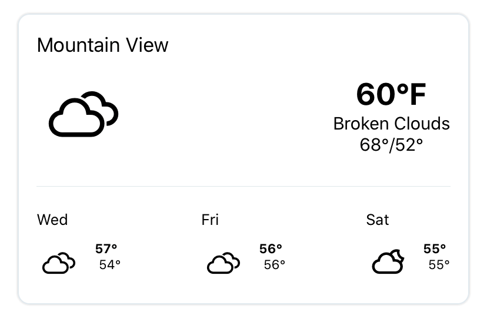

# WeatherCard
<h2> Today and Future 3-days weather forcast</h2>

Implement OpenWeatherAPI and React Native Weather Icons

In order to used the weather service, you need to obtain an API key from https://api.openweathermap.org

Configuring the config.js file by replacing <API_KEY> with API key.

Theww Easy setup with Expo:

    git

    yarn install

    expo start

Clean and neat coded, an success excute should have the following view:

Now you can go ahead and customized the icon youself, and Happy coding.
